# whereisit · 物品在哪

**给自己的每一件东西记一个"路径"。** 个人向的物品位置记录 / 搜索 / 更新应用:
物品位置就是逐层嵌套的文件夹路径,如 `~/ 卧室 / 衣柜 / 上排左格`,找东西时按路径下钻,或者直接搜索。

- **本地优先**:数据存在自己电脑里的单个 SQLite 文件,局域网内手机/平板浏览器直接访问,不依赖任何云服务
- **多用户隔离**:每个使用者一个独立令牌,数据互不可见
- **可选 AI**:接任何 OpenAI 兼容 / Anthropic 协议的大模型(含本地 ollama),用自然语言或一张照片整理目录

<p align="center">
  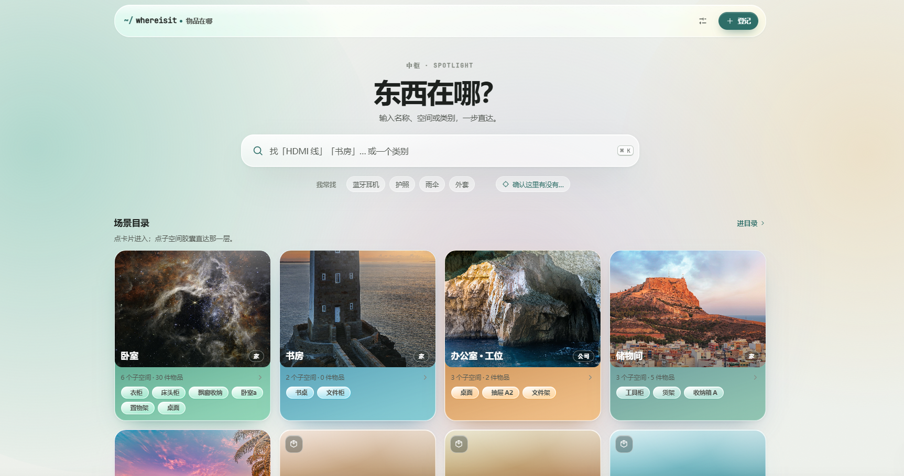
</p>

## 功能

### 基础

- **路径即位置**:空间树逐层嵌套(房间/衣柜/抽屉/盒子统一节点),多场景(家/公司)各自归属,拖拽挪动、防成环
- **同一物品多处存放**:「种类 + 存在」双层模型——"HDMI 线"是一个种类,"抽屉 A2 里有 3 条"是一次存在
- **四种搜索**:精确 / 模糊 / 按分类 / 存在性;中文短词(≤2 字)专门优化;任意页面 `Ctrl/⌘ + K` 全局呼出
- **状态管理**:在库 / 借出(可记归还日期) / 用完;最近处理一键回看、单条可删
- **分类管理**:按数量排序、拖到另一个分类直接合并、一键清理空分类
- **预览图**:物品与场景都能挂照片
- **中英双语**、三套主题、局域网自托管、数据导出/导入备份

| 浏览 | 搜索 |
|---|---|
| 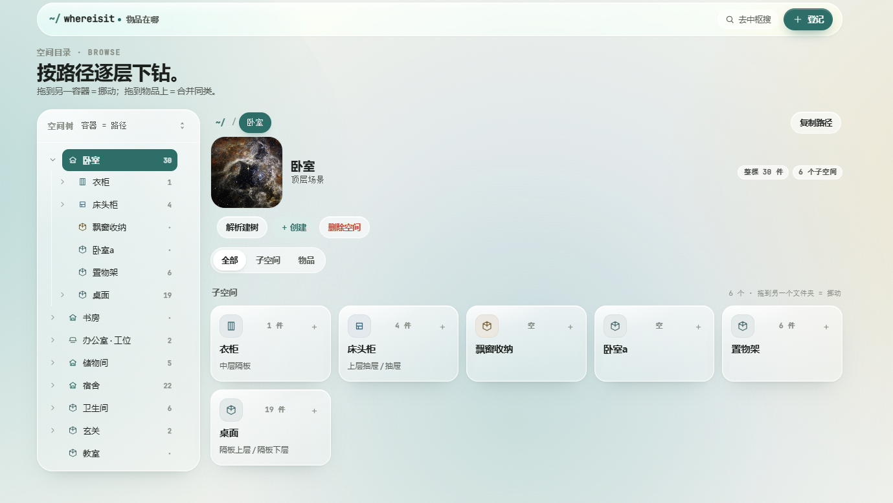 | 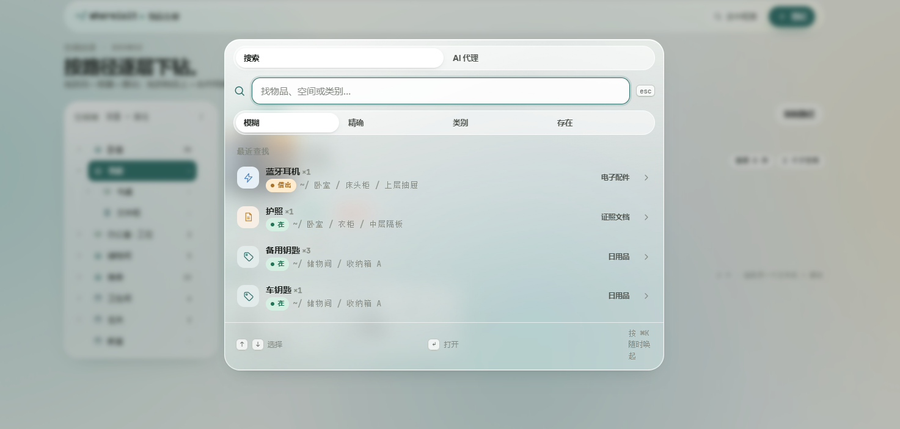 |

| 物品详情 | 登记 |
|---|---|
| 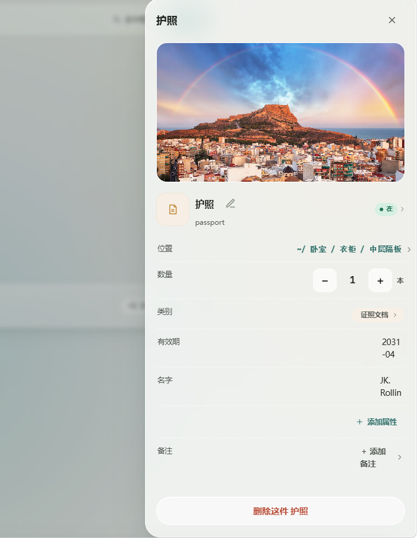 | 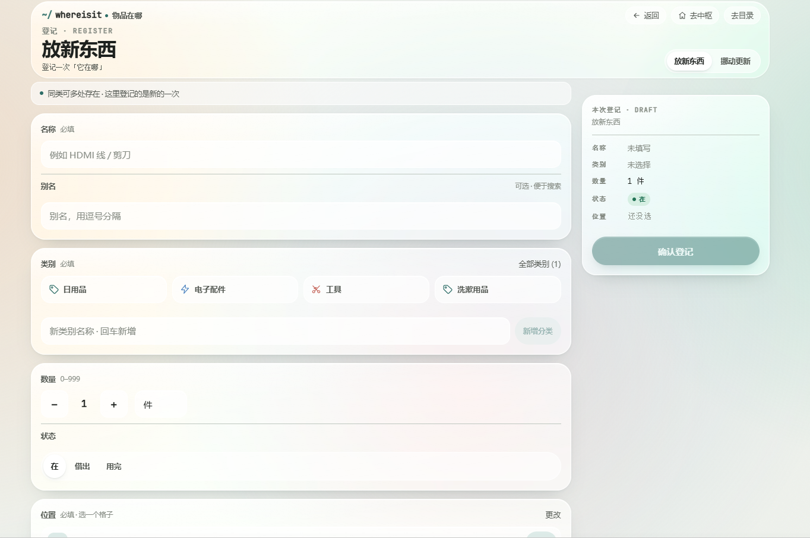 |

### AI 加持(可选,需在设置里配置模型)

- **解析建树**:一段描述或一张照片 → 自动抽出「子空间 + 物品」的目录树 → 可改名/改分类/增删,确认后一键并入现有目录
- **AI 代理**:任意页面 `Ctrl/⌘ + K` 切到「AI 代理」,用自然语言下指令。代理先读目录、**给出带编号的执行方案**(每步标注 新建/修改/删除,可折叠看明细),你确认后才动手;支持"修改方案"让它重出,执行完每条 ✓/✗ 可查,一键整体撤销
- 支持的小工具:建/改/删空间与物品、移动、空间↔物品互转、分类增删改合并、合并重复物品、设预览图、排序、属性与别名
- 未配置模型时 AI 入口自动提示,基础功能完全不受影响

<p align="center">
  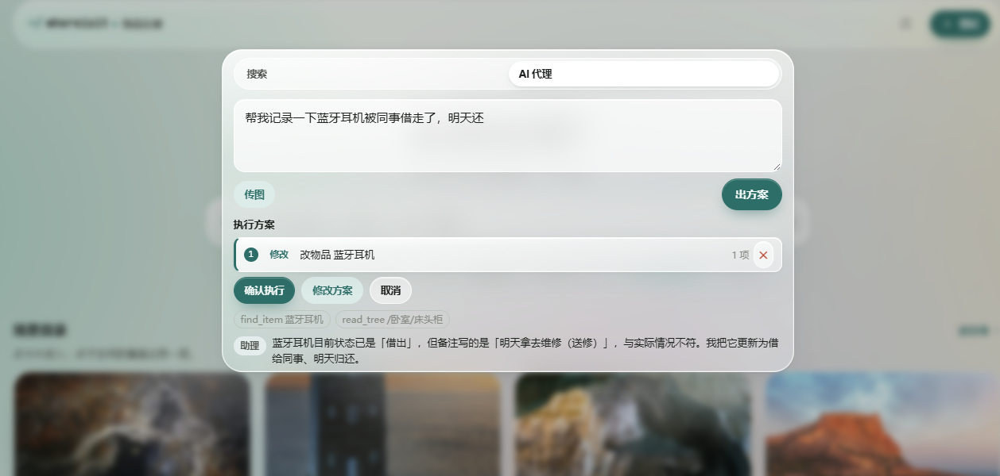<br>
  <sub>AI 代理:读了目录 → 拟好方案(改 玄关/鞋柜/上层 里的钥匙为借出、3 天后还)→ 等你确认</sub>
</p>

<p align="center">
  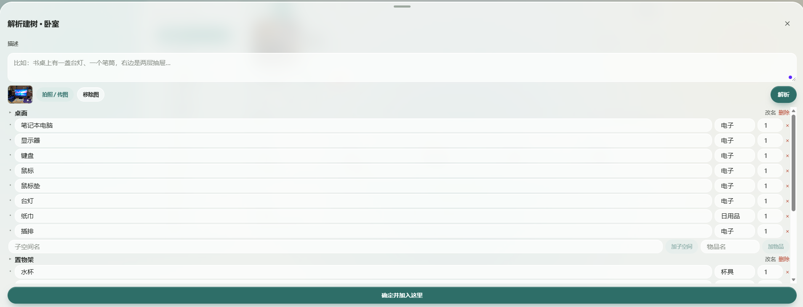<br>
  <sub>解析建树:一张桌面照片 → 可编辑的目录树 → 确定并加入</sub>
</p>

## 三套主题

默认 **玻璃质感**(Apple 式半透明),另有 **扁平低耗** 与 **像素风**(纯 CSS 复古):

| 中枢 | 浏览 |
|---|---|
| 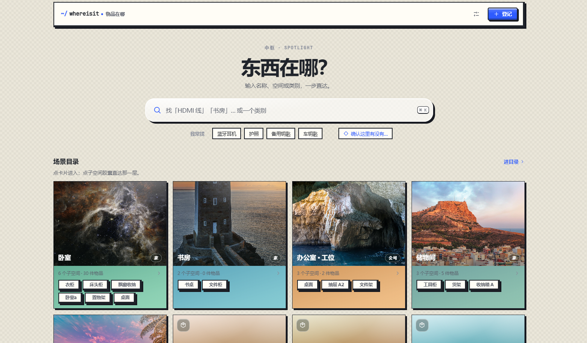 | 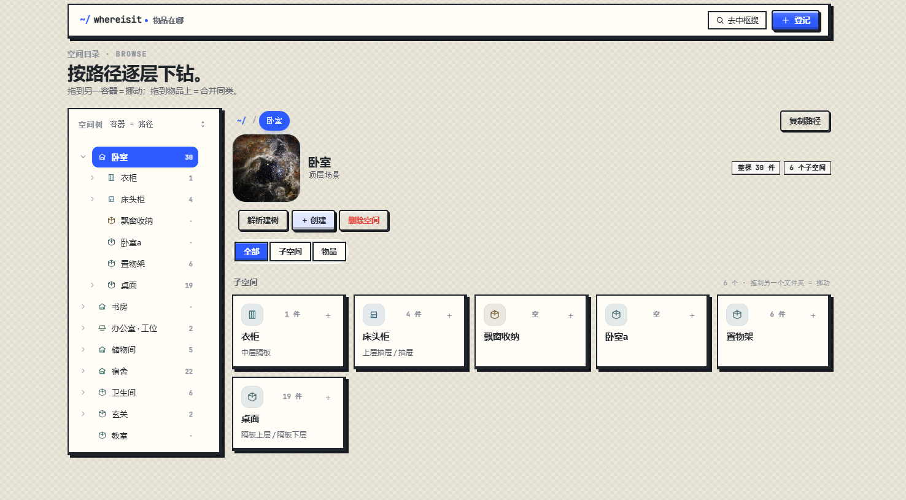 |
| **搜索** | **登记** |
| 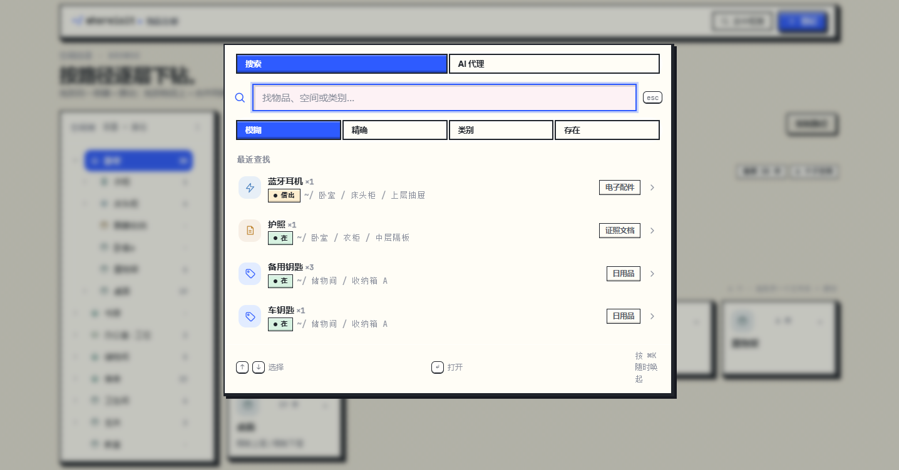 | 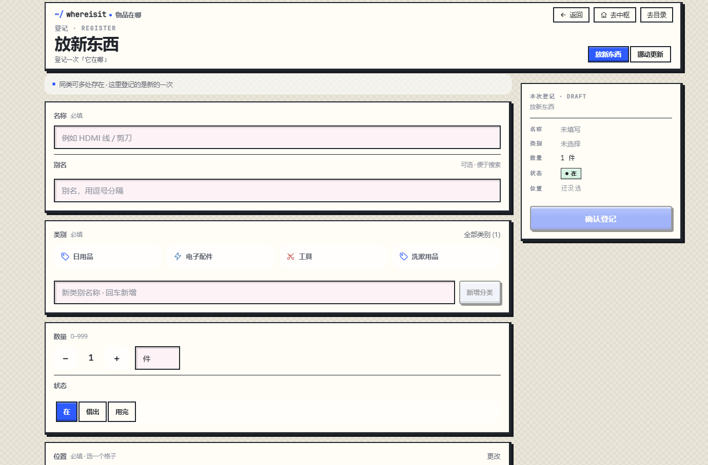 |

## 设置与数据

语言 / 主题 / 大模型(供应商快捷键 + Key 加密存储永不回显)/ 局域网地址 / 访问令牌(复制、下载 `.token`、轮换)/ 数据导出导入 / 多用户管理(每人独立令牌与数据):

<p align="center">
  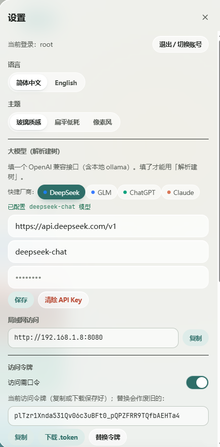
</p>

## 快速开始

要求:Python 3.12+(推荐 conda 虚拟环境)、Node 18+。

```bash
# 1. 后端
cd backend
pip install -r requirements.txt
uvicorn app.main:app --host 0.0.0.0 --port 8080
# 首次启动自动建库/跑迁移;数据落在 backend/data/whereisit.db

# 2. 前端(开发模式)
cd frontend
npm install
npm run dev        # /api 自动代理到 8080

# 生产模式:npm run build 后由 FastAPI 单端口托管构建产物,
# 局域网设备直接访问 http://<PC-IP>:8080
```

### 配置大模型(可选)

设置 →「大模型」填三样:**接口地址**(任何 OpenAI 兼容端点,含本地 ollama)、**模型名**、**API Key**(加密存储,永不回显)。快捷厂商按钮一键填 DeepSeek / GLM / ChatGPT / Claude;Anthropic 协议(Claude)同样支持。

### 数据与安全

- **访问令牌**:可开启口令保护;每个用户独立令牌,支持创建/轮换/吊销,可下载 `.token` 文件用于登录
- **备份**:一键导出全量 JSON,导入按 id 重映射合并
- **数据权属**:单文件 SQLite(`backend/data/whereisit.db`),想搬走就拷走

## 版本

| Tag | 说明 |
|---|---|
| `v1.0.0` / `v1.1.x` | 无 AI 稳定版(基础功能调试线,`v1.1` 分支) |
| `v2.x`(main) | AI 功能主分支 |

## 开发

```
backend/   FastAPI(无 ORM,stdlib sqlite3 + Pydantic v2)
  app/domains/   spaces · items · categories · search · settings · media · llm
  app/db/schema/ 手写迁移 NNN_*.sql
frontend/  React 19 + Vite + zustand,自研玻璃设计系统,中英双语
docs/tech-debt.md   技术债备忘(改表结构/枚举前先读)
```

- 测试:后端 `pytest`(106+ 用例);复杂 UI 走金路径人工自测
- 架构决策与里程碑锚点见 [`PROJECT.md`](PROJECT.md),产品构想见 [`whereisit.md`](whereisit.md)

## License

个人项目,暂未设置开源许可证。
